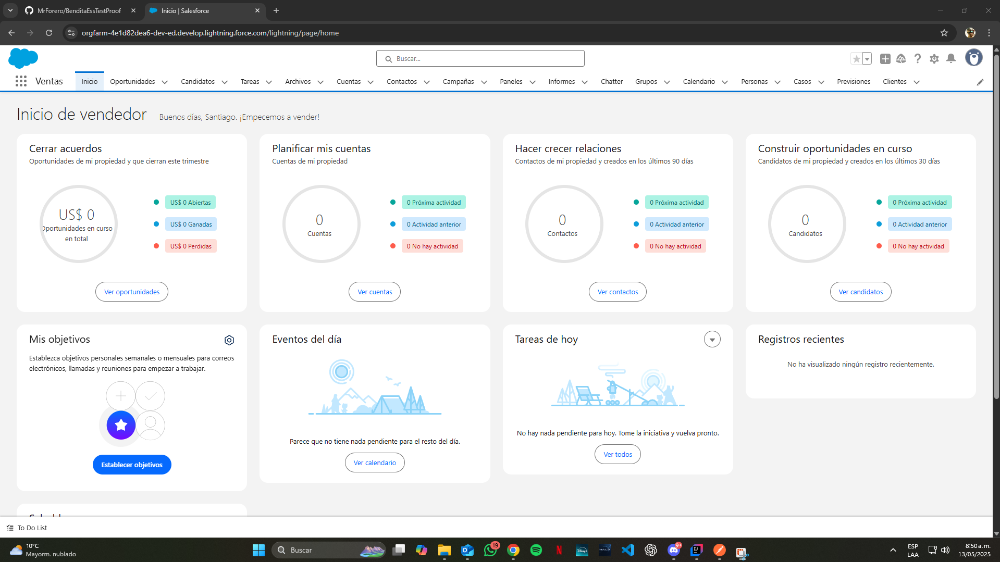
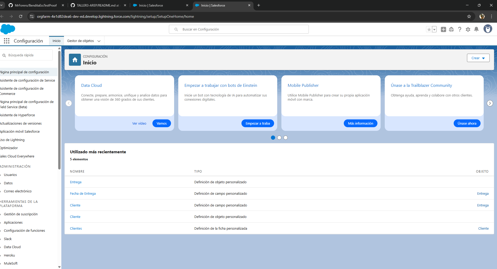
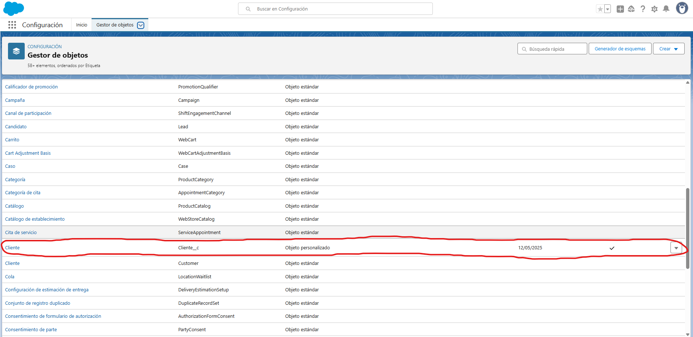
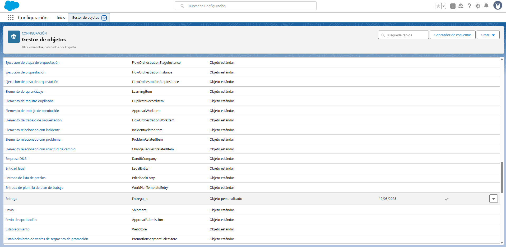
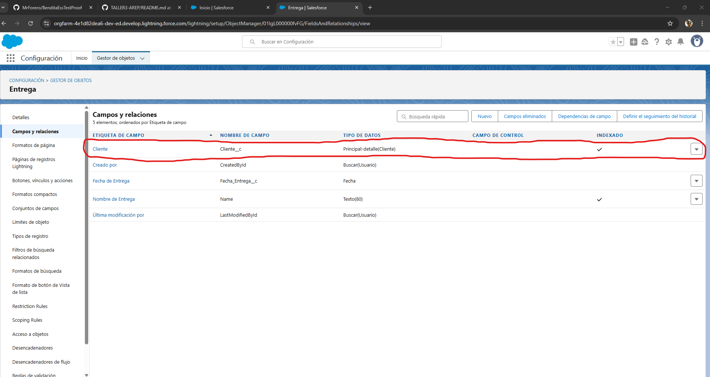
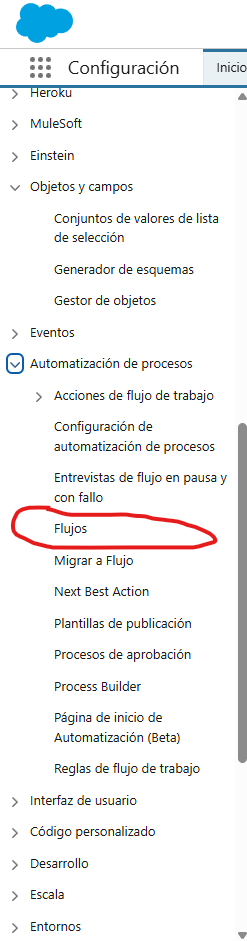
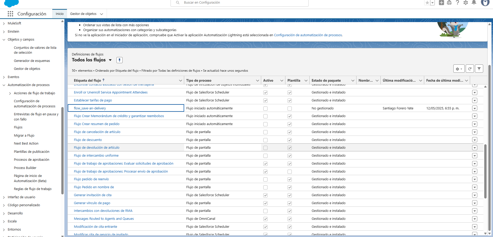
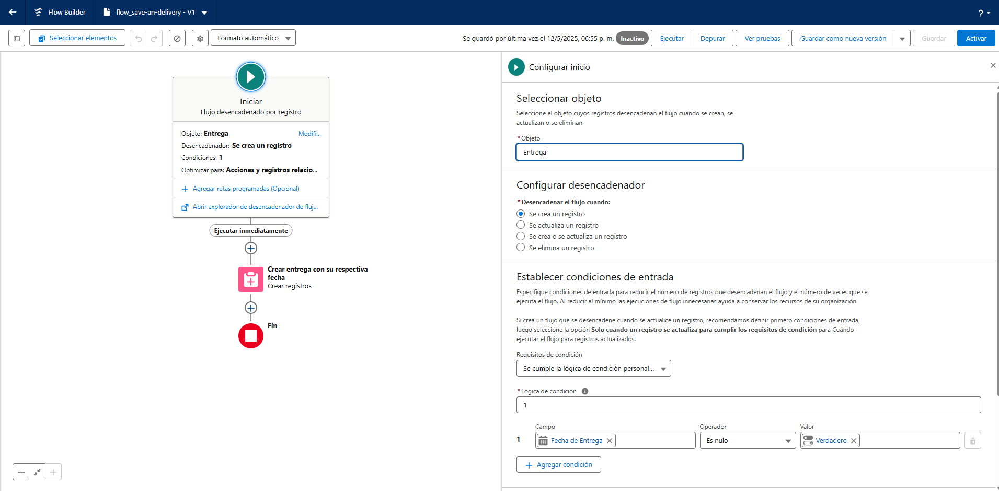

# PRUEBA TECNICA PARA BENDITAESSENCE
En este repositorio se encontrara el codigo fuente, junto con demas explicaciones para completar satisfactoriamente la prueba

## Prueba 1, Trabajo Inicial con Salesforce

Se logra completar el registro inicial y podemos tener acceso al board principal en salesforce

Despues de realizar una exploración, se encuentra la forma de crear los objetos personalizados y despues crearlos
conforme lo pide la prueba

Evidentemente, se observanm los ultimos objetos trabajados, sin embargo, entrando a la pesataña 
"Gestor de objetos" los podemos visualizar en la lista de los demas objetos

Para crear la realción entre los dos objetos, se crea desde entrega, para que se pueda cumplir la condición de que 
el cliente puede tener muchas entregas

Ahora, volviendo al panel principal de configuración, se añade un flujo para actualizar la Fecha de entrega
dentro del objeto Entrega

y configuramos el flujo como se muestra a continuación

## Prueba 2, Creación de un API REST

En este repositorio se encuentra creada una API REST para la creación y consulta de clientes y entregas
con su respectiva relación de 1 a muchos, Además, se adjunta tambien la coleccion POSTMAN usada para 
realizar ciertas pruebas 

## Conclusiones

De esta prueba técnica se aprendió basicamente la gestion de objetos dentro de salesforce y la automatización
para completar cierta información dentro de este, a continuación, el link del video mostrando todo lo realizado
durante esta prueba

[Video](https://www.youtube.com/watch?v=PTSvPfET3JQ)
